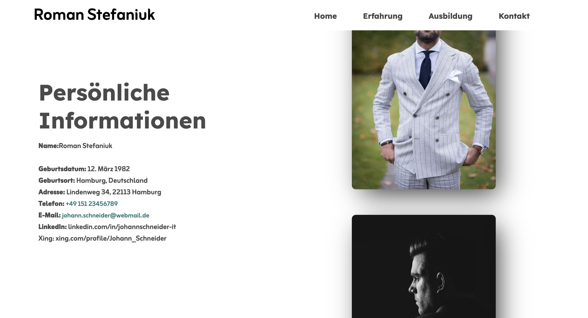
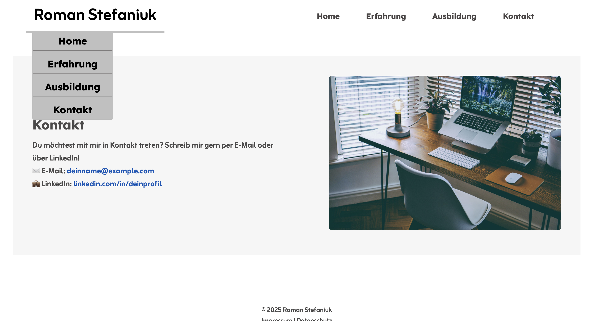

# Personal Resume Prototype (Exam Project) 🎓

This is my final exam project from the Web Development course. It serves as a comprehensive layout for a professional CV and personal portfolio.

> **Note:** This project represents my early learning stage. While it follows a modular structure, I am planning a complete overhaul to enhance the design and unify the codebase.

## 🌟 Key Features
- **Multi-page Structure:** Dedicated sections for Experience, Education, and Contacts.
- **Responsive Layout:** Mobile-friendly design with a custom burger menu implemented via `
`.
- **Visual Effects:** CSS animations (flash effect on targets and sliding image gallery).

## 🛠 Tech Stack
- **HTML5:** Semantic markup for better accessibility.
- **CSS3:** Advanced layouts using CSS Grid and Flexbox.
- **Google Fonts:** Integrated typography (Lexend & Zain).

## 🚀 Roadmap
- [ ] **CSS Refactoring:** Merge separate CSS files into a unified design system.
- [ ] **Modern Icons:** Replace direct image links with SVG or a consistent icon library.
- [ ] **Dynamic Content:** Migrate to a JS-driven approach for rendering work experience.

## 📸 Preview
### Desktop Version

